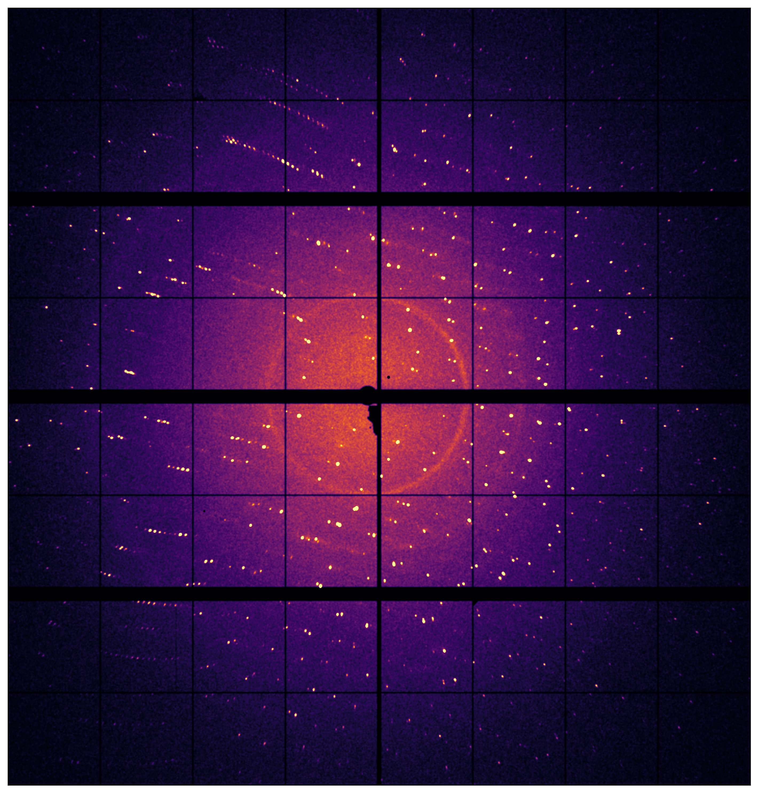

# SSX tools

This is a collection of various useful scripts for SSX data processing and modelling.

## 🚀 Features

### **1. Indexing**
* Uses CrystFEL indexamajig to index HDF5 files
* ...

### **2. Process stream**
* TBD

## Installation
```bash
git clone https://github.com/username/SSX_tools.git
```
## 🛠️ Requirements

### **Software**
* CrystFEL >=0.11.1
* XDS
* CCP4
* ...

### **Python packages**
* NumPy
* Matplotlib
* SciPy
* ...

## Example Image
Nice diffraction image of Myoglobin
<p align="center">
  
</p>
